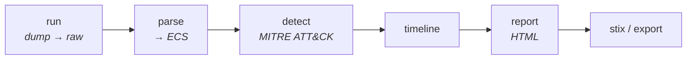

# Madeleine — Memory Forensics Toolkit

[](https://github.com/sltcnb/madeleine/actions/workflows/ci.yml)

Modern automation layer on top of **Volatility3**. Turns expert-only CLI
incantations into a repeatable triage pipeline: orchestrate the right plugins,
normalize output to ECS, hunt malware with heuristics + YARA, reconstruct a
timeline, and ship an HTML report / STIX bundle. CLI, Docker, and Kubernetes.

Madeleine for Madeleine de Proust 

---

## Demo

<p align="center"></p>

## Architecture



## Why

Volatility3 is powerful but demands deep expertise — every command needs the
right plugin, flags, and manual correlation. Madeleine encodes best-practice
plugin sets, parses their output into a single normalized schema (ECS v8), and
runs detection so SOC analysts and junior IR engineers get answers, not raw
tables.

## Pipeline

```
run      dump.raw      → case/raw/<plugin>.json      (Volatility3 output)
parse    case/raw      → case/ecs/<plugin>.ecs.jsonl (normalized ECS)
detect   case/ecs      → ranked threat findings (MITRE ATT&CK mapped)
timeline case/ecs      → ordered / clustered events
report   case/         → case/report.html
export   case/ecs      → jsonl | csv        stix → STIX 2.1 bundle
```

Raw evidence stays separate from derived data. `run` needs Volatility3; **every
later stage works on any pre-collected Vol3 JSON**, so you can analyze offline
and the test suite needs no dump.

## Docs

- **[docs/usage.md](docs/usage.md)** — thorough guide: every command, flag, the
  web API, and the **Talon → Madeleine** acquisition handoff.
- [docs/getting-started.md](docs/getting-started.md) · [docs/deployment.md](docs/deployment.md)

## Install

```bash
pip install -e ".[vol]"        # + Volatility3 for the `run` stage
pip install -e ".[web,dev]"    # web GUI + tests
```

## Quickstart

```bash
# 1. run recommended plugins against a dump (auto OS-detect + parallel)
mneme run memory.raw -o case/

# 2. normalize raw Vol3 JSON → ECS
mneme parse case/raw -o case/

# 3. hunt
mneme detect   case/ecs
mneme timeline case/ecs --cluster
mneme report   case/                 # → case/report.html
mneme stix     case/ecs -o iocs.json
```

Already have Vol3 JSON? Drop it in `case/raw/` (named `<plugin>.json`) and start
at step 2 — no dump or Volatility3 required.

## Detection

Heuristics over normalized events, each mapped to MITRE ATT&CK, confidence
scored, and correlation-boosted when multiple signals hit the same PID:

| Check | Technique | ATT&CK |
|-------|-----------|--------|
| Process injection | RWX private memory (malfind) | T1055 |
| Process hollowing | anomalous parent process | T1055.012 |
| DKOM | process in scan but not active list | T1014 |
| Rootkit | hooked syscall / SSDT / IDT | T1014 |
| Persistence | service running a LOLBin / temp path | T1543.003 |
| Credential theft | injection into / access to lsass | T1003.001 |
| YARA | rule match on malfind regions | — |

## Deployment

```bash
# Desktop / CLI — see Install above.

# Docker (web GUI at http://localhost:8080)
docker compose up --build

# Kubernetes
kubectl apply -f k8s/deployment.yaml
```

Web mode serves a dependency-free dashboard at `/` and a JSON API under `/api`.
Cases live under `MNEME_DATA` (default `/data`); per-user workspaces map to
per-user case subdirectories. JWT/OAuth + RBAC bolt on at the gateway.

## Layout

```
Madeleine/
├── cli.py                 # run | parse | detect | timeline | report | export | stix | serve
├── core/
│   ├── orchestrator.py    # Vol3 subprocess wrapper: cache, parallel, OS detect
│   ├── plugins.py         # recommended plugin sets + OS detection
│   ├── parser.py          # Vol3 JSON → ECS (tolerant, registry-based)
│   ├── detector.py        # malware heuristics + YARA + correlation
│   ├── timeline.py        # timeline build + clustering
│   ├── ioc.py             # IOC extraction + STIX 2.1
│   ├── report.py          # self-contained HTML report
│   └── exporter.py        # jsonl / csv
├── ecs/schema.py          # ECS v8 forensic event model (pydantic)
└── api/server.py          # FastAPI backend + SPA dashboard
```

## Test

```bash
pytest -q                                    # unit tests, no dump needed
ruff check .                                 # lint

# opt-in end-to-end against a real image (needs Volatility3):
MNEME_TEST_DUMP=/path/to/mem.raw pytest -m integration
python scripts/validate_dump.py mem.raw      # full pipeline + column-drift report
```

`scripts/validate_dump.py` flags any collected dataset whose real Vol3 columns
don't map to events — the drift the synthetic tests can't catch.

## License

Apache-2.0.
